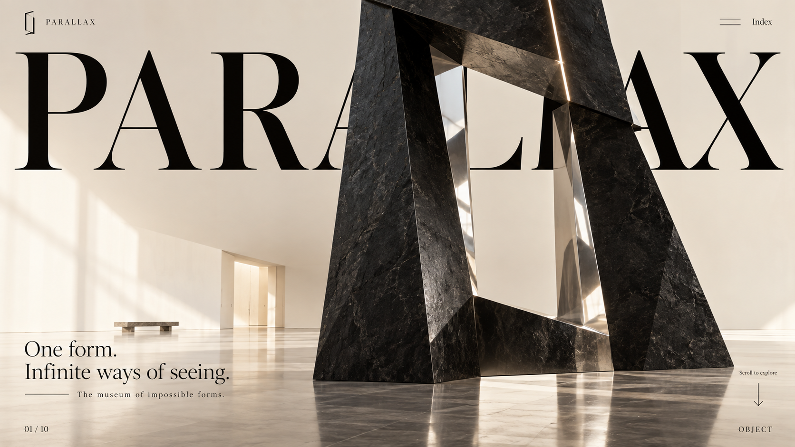
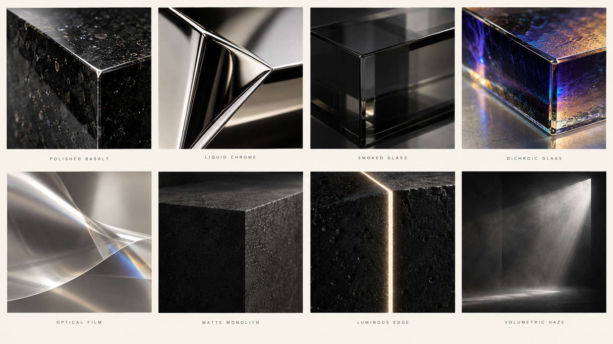
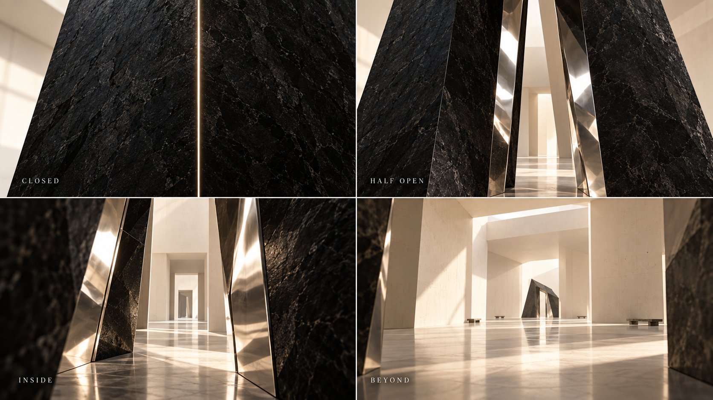

# PARALLAX VISUAL BIBLE
## The Museum of Impossible Forms

**Governing image:** an architectural black-stone mass, chrome cut interiors, one hairline luminous incision. The object retains a tall asymmetric quadrilateral silhouette and an empty oblique central aperture. It is seen in ten states; it is never replaced by a new sculpture.

## Selection and art direction

Three complete hero directions were generated and compared before source implementation: ivory gallery, black void, and an optical-film composition. The ivory gallery is selected for the opening because it preserves the strongest silhouette, generous negative space and readable type. Dark space becomes the setting of CHROMA and HALO. Optical film belongs to MEMBRANE. Rejected hero images are not delivered.

The material board explores eight surfaces. Only black stone, chrome and a fine ivory slit define the master object. Smoked/dichroic optical surfaces are conditions of viewing, rather than new bodies. CHROMA was refined to confine coloured illumination to edges and chrome. HALO was refined to lower body illumination.

## Hero and master object

Primary mass: angular polished black stone, broad weighted faces, subtle mineral grain.
Secondary structure: sharply faceted mirror-chrome aperture and cut faces.
Signature detail: one narrow ivory incision across the offset upper blade.
No spheres, blobs, round rings, random shards, drifting particles or arbitrary looping rotation.

Opening composition: oversized PARALLAX lettering across the upper field, behind a cropped monumental object at the right. A quiet independent gallery plate supports the composition. The opening object cutout, architecture and DOM type remain separate layers. Small pointer movement changes layering only; it is not presented as an orbit.

## Design system

- Warm ivory field: #e9e2d6, sampled approximately from the selected composition; charcoal: #111110; deep void: #090909.
- Typography: locally bundled Bodoni Moda 400 for the precise high-contrast Roman display; Manrope 400/500 for restrained navigation and small captions.
- Chrome: reflective silver with warm room fill, clean skylight highlights and narrow dark architectural bands within the cut faces.
- Optical accents: cobalt, violet, a little ruby and amber, restricted to light interacting with edges.
- Spacious full-bleed composition; no cards, dashboard grids, loading show or introductory gate.
- Desktop outer margin: approximately 3.2vw. Phone outer margin: 22px. Small controls retain a minimum 44px hit area.
- Hero wordmark is a real DOM h1. Chapter display copy is real DOM, decorative repeated/reflected text is hidden from assistive technology.

## Motion grammar

Separate → suspend → align → reflect → enter → refract → colour → almost disappear → reassemble → step back.
The native document scroll is the only timeline. Scene state is sampled, not accumulated. Reverse traversal uses the same state function. Motion has deliberate rests and authored camera paths. No perpetual idle object spin.
Reduced motion selects composed chapter poses, removes pointer parallax and uses instant anchor travel. All chapters and text remain available.

## Production decisions

| Scene / target | AI generation | Direct AI use | Reconstruction and live layer | Medium | Quality check |
|---|---|---|---|---|---|
| 01 OBJECT — [frame](../../provenance/parallax/reference/01-object.png) | Hero alternatives, isolated complete master object, empty gallery, mobile composition | Transparent hero object and empty architectural plate | Layered title occlusion, small pointer separation, transition into live sculpture | DOM + AI plates + 2.5D | Large mass, readable PARALLAX, clean alpha, correct crop and generous lower copy |
| 02 FRAGMENT — [frame](../../provenance/parallax/reference/02-fragment.png) | Exploded same-form target and cut-face design | Stone texture; shared gallery plate where appropriate | Same persistent beveled fragments separate into deliberate authored positions | Three.js geometry + studio environment | Original silhouette still traceable; gaps reveal chrome rather than random rubble |
| 03 ALIGNMENT — [frame](../../provenance/parallax/reference/03-alignment.png) | Singular-view aligned target | Stone texture | Fragments placed at different depths using camera-ray scaling; real perspective camera moves into alignment. Align view restores exact viewpoint | Three.js + DOM control | Projected outline agrees at the reference camera, separates when viewpoint moves; accessible alignment action |
| 04 REFLECTION — [frame](../../provenance/parallax/reference/04-reflection.png) | Mirror composition | Stone texture and environment art | True mirrored camera and planar render target; camera/geometry motion updates the reflection | Three.js Reflector | Correct doubled object, no static imitation, controlled mirror edges and readable caption |
| 05 RIFT — [frame](../../provenance/parallax/reference/05-rift.png), [states](../../provenance/parallax/reference/rift-study.png) | Closed, half-open, inside and beyond studies | Architecture may serve as distant backdrop; stone map | Heavy geometric sides open; chrome interior surfaces and deeper architectural planes create occlusion; camera enters opening | Three.js geometry / spatial camera | Reads as an incision becoming depth, with no circular portal effect |
| 06 MEMBRANE — [frame](../../provenance/parallax/reference/06-membrane.png) | Optical-film composition and material study | Shared material texture | Live scene capture sampled through a subdivided, mildly displaced optical plane with Fresnel highlights | Render target + refraction shader | The content behind the sheet actually refracts; film stays secondary to the master silhouette |
| 07 CHROMA — [frame](../../provenance/parallax/reference/07-chroma.png) | Coloured cut-face study, refined to remove broad room colour | Stone map | Camera-dependent spectral coating on chrome cuts, with restrained coloured rim light | Three.js materials + optical shader | Predominantly black mass; cobalt/violet with restrained ruby/amber, no decorative gradient UI |
| 08 HALO — [frame](../../provenance/parallax/reference/08-halo.png) | Boundary-light target, refined darker | Stone map | Same sculpture edges, fine light slit, reduced illumination and controlled grazing light | Three.js edges / light | Form remains recognizable through its boundary, no rings or excessive bloom |
| 09 REASSEMBLY — [frame](../../provenance/parallax/reference/09-reassembly.png) | Final assembled target | Stone texture | Persistent fragments return to stored rest transforms with ordered heavy movement | Real geometry | Same object returns, no model/image substitution; correct reverse traversal |
| 10 THE MUSEUM — [frame](../../provenance/parallax/reference/10-museum.png) | Monumental room, separate empty architecture plate | Empty museum architecture plate | Live master object and camera reduce in relative scale; subtle spatial floor and placement | AI architecture + Three.js object | A single object in a vast room; no extra artworks or decorative clutter |

## Scene copy and typography placement

| State | Main line | Supporting line | Position |
|---|---|---|---|
| OBJECT | PARALLAX | One form. Infinite ways of seeing. / The museum of impossible forms. | Title behind work; orientation lower left |
| FRAGMENT | Distance enters the object. | The cuts were always there. Now the space between them becomes visible. | Upper left, compact width |
| ALIGNMENT | A whole, from here. | Find the view where the fragments agree. | Upper left; Align view below |
| REFLECTION | Another surface. Another reading. | Your position changes what the mirror reveals. | Lower left, outside mirror |
| RIFT | An opening becomes a place. | Follow the cut beyond the surface. | Lower left, clear of the incision |
| MEMBRANE | Seen through something. | A thin boundary holds the form at a distance. | Left, outside the strongest refraction |
| CHROMA | The edge acquires colour. | Light moves across the cut. The mass remains. | Lower left in ivory |
| HALO | Almost absent. | For a moment, only the boundary remains. | Smallest display moment, low left |
| REASSEMBLY | The same form, differently seen. | The fragments return. So does everything you have noticed. | Low left, returning proportions |
| THE MUSEUM | One object. An impossible room. | A form does not exist only in matter. It also exists in the act of seeing. | Low left plus small upper-left thought |

## Navigation, access and fallback

The index contains ten real chapter anchors, selected-state indication, motion preference and Focus artwork controls. Escape closes the index and returns focus. Native scrolling, keyboard page navigation and touch remain available. Align view provides the key spatial moment without requiring a mouse. Begin again returns to OBJECT.

The artwork appears immediately using local assets. A WebGL failure or context loss retains an authored visual and readable chapter content instead of a blank canvas. A fallback is described honestly; it does not claim to provide real spatial interaction.

## Resolution and acceptance

Targets were generated at 1672×941, with a separate portrait object asset; exact source dimensions and hashes are recorded in provenance. Live geometry and DOM render at the available display resolution. 4K verification means a 3840×2160 viewport, not a claim that each AI source raster is natively 4K.

Inspect every major scene paused, with its target beside it. Compare composition, silhouette, material hierarchy, type, colour and negative space. Check 1920×1080, 2560×1440, 3840×2160, 390×844 and a narrow 320px viewport. Include portrait tablets and short landscape screens; protect the introductory copy, the complete alignment silhouette and footer. Test reverse, resize during rest and navigation, refresh, restore, reduced motion, keyboard, local assets and the exact alignment projection. QA screenshots and traces stay outside the ZIP.

## Selected material and transition studies

